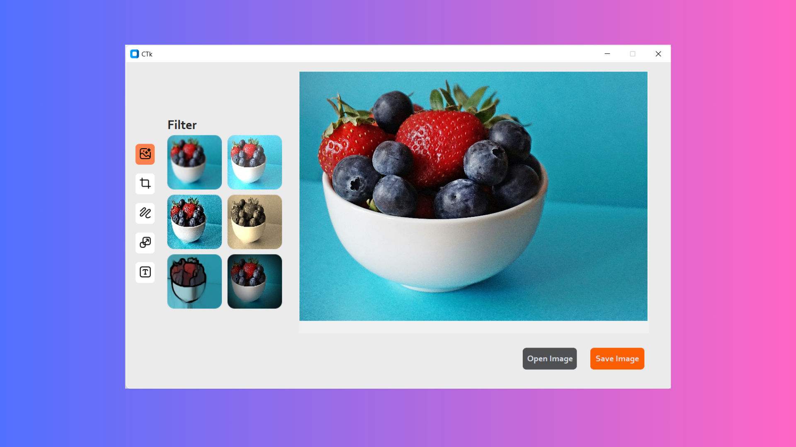

# 🖼️ Image Editor

**Image Editor** is a local Python-based tool that allows users to apply powerful image processing features using an intuitive GUI. Built with OpenCV, it provides a lightweight and fast image editing experience for simple tasks.

---

## 📸 Screenshots



---

## 🚀 Features

- ✂️ Crop, resize, and rotate images
- 🎨 Apply filters like grayscale, blur, and edge detection
- 💾 Save edited images locally
- 📂 Load any image from your local file system
- 🧰 Simple and fast local execution without internet dependency

---


## 🧰 Tech Stack

- **Python**
- **OpenCV**
- **Tkinter**

---

## 🛠️ Getting Started

### Prerequisites

- Python 3.x
- OpenCV (`cv2`)
- Tkinter

### Installation

```bash
git clone https://github.com/YashwantHabib/image-editor.git
cd image-editor
pip install opencv-python
python main.py
